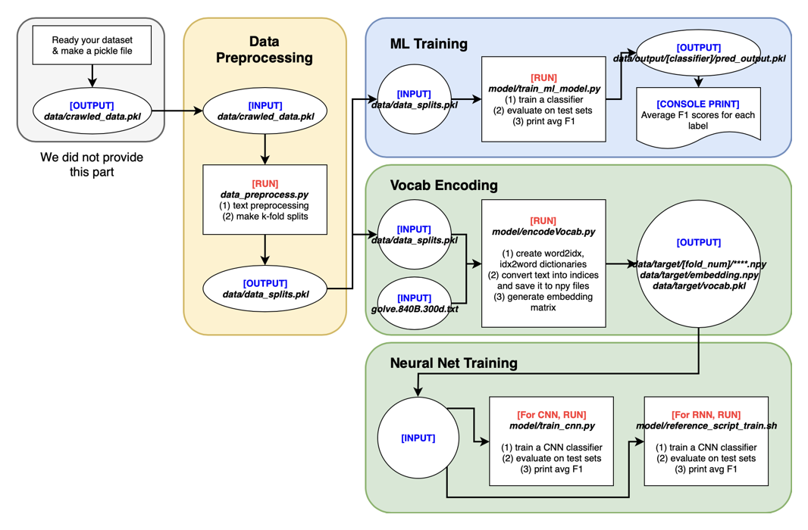

# Comparative Studies of Detecting Abusive Language on Twitter

Python 3.6.0 implementation of ["Comparative Studies of Detecting Abusive Language on Twitter"](http://arxiv.org/abs/1808.10245) accepted in <a href="http://emnlp2018.org/program/workshops/">EMNLP 2018 Workshop on Abusive Language Online (ALW2)</a>.
This paper conducts a comparative study of various learning models on [Hate and Abusive Speech on Twitter](https://github.com/ENCASEH2020/hatespeech-twitter) dataset, which has great potential in training deep models with its significant size.

## Requirements
The following script will install required Python packages.

```
pip3 install -r requirements.txt
```

## Workflow Diagram


## Data Preprocessing
Data preprocessing consists of three steps:
1. Download the source data (*Hate and Abusive Speech on Twitter*). The dataset's each row is consisted of a tweet ID and its annotation. 
2. Crawl tweets based on tweet ID. Note that **you might not be able to crawl full data of tweets with tweet IDs**, mainly because the tweet is deleted or the user account has been suspended. Please fill in your Twitter app credentials from line 57 in the [./data_preprocess.py](./data_preprocess.py) script.
3. Preprocess raw text data---basic text preprocessing (e.g. handling hashtags and URLs) and splitting the data into 10 randomly divided folds.

Run the following script with specified parameters:

```
python3 data_preprocess.py
	--download_source (Whether or not download the source csv file; default: True)
	--crawl_tweets (Whether or not crawl tweets; default: True)
	--feature_level (Feature representation level. 'word' or 'char'; default: 'word')
```

## Training & Evaluation
Go to the [./model](./model) directory and run the following script with specified parameters.

```
python3 train.py
	--feature_level (Feature representation level. word' or 'char'; default: 'word')
	--clf (Type of classifier; Type: char)
```

For the RNN models, please refer the reference script. (updated 11-Jun-2019)
```
./model/reference_script_train.sh
```
- results will be displayed in console 
- final results will be appended in "./model/TEST_run_result.txt" 
- [for quick test purpose] preprocessed dataset [<a href="http://milabfile.snu.ac.kr:16000/share-EMNLP-WS-18_abusive/data.tar.gz">link</a>] <br> 
(works only for the RNN models (train_rnn.py, train_rnn_ctx.py) except for character-level RNN (train_rnn_char.py) )


### Traditional Machine Learning Models
In order to report the baselines of feature engineering based machine learning models, we experimented with Naïve Bayes, Logistic Regression, Support Vector Machine, Random Forests, and Gradient Boosted Trees. We tune n-gram ranges and maximum length of features as hyperparameters. Please modify the code [./model/train_ml.py](./model/train_ml.py) in order to try different settings (e.g. loss function, learning rate, etc.)

**Parameter Description**
+ clf: We implemented 5 different feature engineering based machine learning classifiers. Use the following representations---'NB': Naïve Bayes, 'LR': Logistic Regression, 'SVM': Support Vector Machine, 'RF': Random Forests, 'GBT': Gradient Boosted Trees
+ ngram_range: Enter a comma-separated string describing the ngram range. For example, '1,3' means that you will use unigram, bigram, and trigram features. In this paper, we used '1,3' for word-level, and '3,8' for character-level representations.
+ max_features: Due to the size of the dataset, you might want to only consider the most significant features (largest feature values). You will use feature values that are normalized with TF-IDF values. We used 14,000 for word-level, and 53,000 for character-level features. Especially for GBT, we reduced feature length even further to 1,200 and 2,300.

Evaluating traiditional machine learning models require pickle files of prediction scores, generated in `./data/output/*FEATURE_LEVEL*/*CLASSIFIER*/*FOLD_NUM*/pred_output.pkl`. Please double check if you have generated such files successfully from the above training script.

### Neural Network Models
We experimented Convolutional Neural Networks (CNN) and Recurrent Neural Networks (RNN) as baselines. Before training, we generate vocabulary dictionaries (e.g. word to index), and convert each tweet message into numpy object with its feature representations.

**Parameter Description**
+ clf: We implemented 2 networks, CNN': Convolutional Neural Networks, 'RNN': Recurrent Neural Networks, as baseline models
+ process_vocab: Initial procedure for generating vocabulary dictionaries and converting tweets into numpy objects
+ use_glove: If True, we use GloVe pre-trained embedding for word-level features. This procedure includes downloading GloVe if you don't have it in your root directory. If False, we use randomly generated embeddings
+ context_tweet: You can include context tweet information to the word-level feature models. Please refer to the detailed description of the model in the paper

**CNN Variant Models**
+ hybrid_cnn: HybridCNN is a model that combines word-level and character-level features. Baseline model is proposed by [Park and Fung](https://arxiv.org/abs/1706.01206)

**RNN Variant Models**
+ attn: In order to make the classifier better understand the text sequences, we implemented self-matching attention mechanism ([Wang et al.](http://www.aclweb.org/anthology/P17-1018)) with the RNN baseline models.
+ ltc: Latent Topic Clustering ([Yoon et al.](https://arxiv.org/abs/1710.03430)) extracts latent topic information from the hidden states of RNN in order to classify the data.

Evaluating neural network models require checkpoint files of prediction scores, generated in `./data/output/*FEATURE_LEVEL*/*MODEL_NAME*/*FOLD_NUM*/*NAME_OF_OUTPUT_FILE*`. Please double check if you have generated such files successfully from the above training script.

## Reference
Please refer the following paper in order to use the code as part of any publications.

```
@article{lee2018comparative,
	title={Comparative Studies of Detecting Abusive Language on Twitter},
	author={Lee, Younghun and Yoon, Seunghyun and Jung, Kyomin},
	journal={arXiv preprint arXiv:1808.10245},
	year={2018}
}
```
